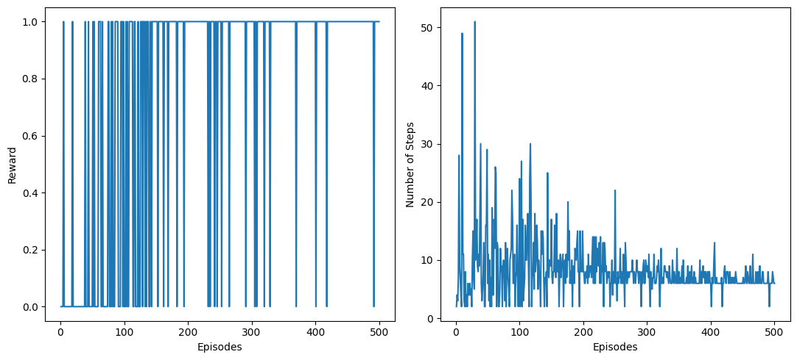
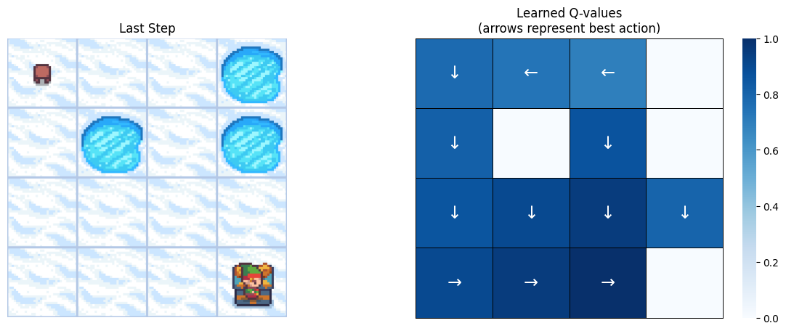

# FrozenLake Q-Learning

<center></center>

A reinforcement-learning project that trains and evaluates a **tabular Q-learning** agent on Gymnasium’s **FrozenLake-v1** environment.

---

## Features

- Tabular **Q-learning** with epsilon-greedy exploration
- Reproducible environment setup (seeded random map or fixed map)
- Saves run artifacts:
  - `qtable.npy`, `config.json`, `history.json`, `metrics.json`
  - `learning_curve.png`, `policy_heatmap.png`
- CLI commands: `train`, `eval`, `plot`

---

## Install

```bash
python -m venv .venv
source .venv/bin/activate

pip install -r requirements.txt
```

Optional dev tools (for local lint/tests):

```bash
pip install pytest ruff
```

---

## Quickstart

### Train

```bash
python scripts/train.py --episodes 500 --max-steps 100 --map-size 4 --map-seed 10
```

This creates a new run folder under:

```text
results/runs/<timestamp>_seed<seed>_ms<map_size>_slip<0|1>/
```

### Evaluate

Evaluate a saved run directory:

```bash
python scripts/eval.py --run-dir results/runs/<your_run_folder> --episodes 100
```

Or evaluate a standalone Q-table file (using a newly-created env config):

```bash
python scripts/eval.py --qtable results/runs/<your_run_folder>/qtable.npy --episodes 100 --map-size 4 --map-seed 10
```

### Regenerate plots

```bash
python scripts/plot.py --run-dir results/runs/<your_run_folder>
```

---

## Configuration

### Environment flags

- `--map-size` (default: 4)
- `--map-seed` (default: 10) for reproducible random map generation
- `--slippery` enables stochastic transitions (default is non-slippery)

### Q-learning hyperparameters

- `--lr` (learning rate, default: 0.8)
- `--gamma` (discount factor, default: 0.95)
- `--epsilon-start` (default: 1.0)
- `--epsilon-min` (default: 0.01)
- `--epsilon-decay` (default: 0.995)

---

## Outputs

Each training run saves:

- `qtable.npy`: learned Q-table (NumPy array shaped `[n_states, n_actions]`)
- `config.json`: environment + training configuration (includes the map/desc used)
- `history.json`: per-episode rewards/steps/epsilons
- `metrics.json`: evaluation summary (success rate, averages, per-episode stats)
- `learning_curve.png`: reward and steps per episode
- `policy_heatmap.png`: max Q-values heatmap with best-action arrows

---

## Results





---

## License

MIT (see `LICENSE`).
